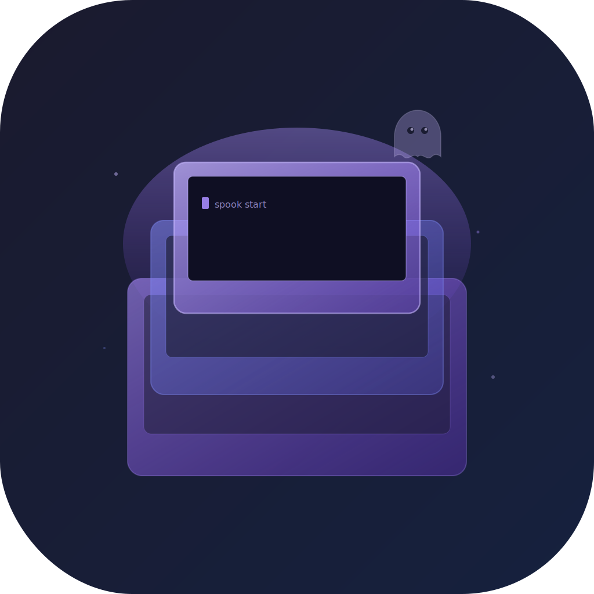

<div align="center">



# Spooktacular

**Enterprise macOS virtualization for Apple Silicon.**<br>
2x your EC2 Mac CI capacity. Open source. Self-hosted anywhere.

[](https://github.com/Spooky-Labs/spooktacular/actions)
[](https://github.com/Spooky-Labs/spooktacular/actions)
[](https://swift.org)
[](https://developer.apple.com/macos/)
[](LICENSE)

[Website](https://spooktacular.app) · [API Docs](https://spooktacular.app/api/documentation/spooktacularkit/) · [Roadmap](https://spooktacular.app/roadmap.html) · [Compare](https://spooktacular.app/compare.html)

</div>

---

## What is Spooktacular?

Spooktacular runs macOS virtual machines on Apple Silicon using Apple's [Virtualization.framework](https://developer.apple.com/documentation/virtualization). Each Mac runs up to 2 VMs — doubling your CI capacity on the same hardware, at zero additional cost.

```bash
brew install --cask spooktacular

spook create base --from-ipsw latest --cpu 8 --memory 16
spook clone base runner-01
spook clone base runner-02
spook start runner-01 --headless --user-data ./setup.sh --provision ssh
spook start runner-02 --headless --user-data ./setup.sh --provision ssh
# Two runners. One Mac. Half the cost.
```

## Why Spooktacular?

| Pain point | How we solve it |
|---|---|
| EC2 Mac costs $26/day per runner | **Run 2 VMs per host → 50% cost reduction** |
| Anka charges per-core, no public pricing | **MIT licensed, $0 forever** |
| Orka locks you to MacStadium | **Self-hosted anywhere: EC2, colo, Mac mini rack** |
| Tart has no GUI | **Native SwiftUI app + 16 CLI commands + menu bar** |
| Golden images take hours | **Setup Assistant automation → SSH → user-data** |

## The EC2 Mac Math

| EC2 Macs | Before | After | Annual savings |
|---|---|---|---|
| 5 | 5 runners | **10 runners** | ~$47,000 |
| 10 | 10 runners | **20 runners** | ~$95,000 |
| 20 | 20 runners | **40 runners** | ~$190,000 |

<sub>Based on mac2-m2pro.metal at $1.08/hr. 2 VMs per host vs 1 bare-metal runner.</sub>

## Features

**VM Lifecycle** — Create from IPSW, instant APFS cloning (48ms for 30GB), start/stop with PID tracking, 2-VM capacity enforcement, graceful SIGTERM shutdown.

**Provisioning** — Setup Assistant keyboard automation (macOS 15 & 26). SSH-based user-data execution with output streaming. GitHub Actions runner template. Four modes: disk-inject, SSH, agent, shared-folder.

**Networking** — NAT (default), bridged (with entitlement), isolated (zero network). MAC address configuration. IP resolution via DHCP leases + ARP table.

**Hardware** — CPU (4+ cores), memory (4–64 GB), APFS sparse disks, 1–2 Metal GPU displays, audio, shared folders, clipboard, VirtIO socket, memory balloon.

**CLI** — 16 commands, styled ANSI output, `--json` for automation, `--field` for scripting, `NO_COLOR` support.

**GUI** — SwiftUI, NavigationSplitView, inspector panel, progressive disclosure, Liquid Glass (macOS 26+), menu bar extra, full VoiceOver + WCAG 2.1 accessibility.

## How It Compares

<table>
<tr><th></th><th>Spooktacular</th><th>Tart</th><th>Anka</th><th>Orka</th></tr>
<tr><td><b>License</b></td><td><b>MIT (free)</b></td><td>Fair Source</td><td>Proprietary</td><td>Proprietary</td></tr>
<tr><td><b>Price</b></td><td><b>$0</b></td><td>$0–$36K/yr</td><td>Contact sales</td><td>$499+/mo</td></tr>
<tr><td><b>GUI app</b></td><td>✓ SwiftUI</td><td>✗</td><td>✓</td><td>✓</td></tr>
<tr><td><b>CLI</b></td><td>✓ 16 commands</td><td>✓</td><td>✓</td><td>Limited</td></tr>
<tr><td><b>Self-hosted</b></td><td>✓</td><td>✓</td><td>✓</td><td>✗ MacStadium</td></tr>
<tr><td><b>Capacity enforcement</b></td><td>✓ 2-VM limit</td><td>✗</td><td>✓</td><td>✓</td></tr>
<tr><td><b>IP resolution</b></td><td>✓ ARP+DHCP</td><td>✓</td><td>✓</td><td>✓</td></tr>
<tr><td><b>Setup automation</b></td><td>✓ Keyboard</td><td>✓ Packer</td><td>✓</td><td>Manual</td></tr>
<tr><td><b>User-data via SSH</b></td><td>✓</td><td>SSH only</td><td>✓</td><td>Limited</td></tr>
<tr><td><b>OCI registries</b></td><td>Planned</td><td>✓</td><td>Proprietary</td><td>Docker</td></tr>
<tr><td><b>K8s operator</b></td><td>Planned</td><td>Orchard</td><td>✗</td><td>✓</td></tr>
</table>

## CLI

```
spook create <name>     Create VM from IPSW (--github-runner, --openclaw, --remote-desktop)
spook start <name>      Boot VM (--headless, --recovery, --user-data, --provision ssh)
spook stop <name>       Stop via SIGTERM (--force for SIGKILL)
spook list              List VMs with running state (--json)
spook clone <src> <dst> Instant APFS clone with new MachineIdentifier
spook delete <name>     Delete VM and bundle (--force skips confirmation)
spook ip <name>         Resolve VM IP via DHCP/ARP
spook ssh <name>        SSH into running VM
spook exec <name> --    Run command via SSH
spook get <name>        Show config (--json, --field cpu)
spook set <name>        Modify config (--cpu, --memory, --displays, --network)
spook snapshot <name>   Save VM state (planned)
spook restore <name>    Restore from snapshot (planned)
spook share <name>      Manage shared folders
```

## Architecture

```
SpooktacularKit         Core library (Apple Virtualization.framework)
├── VirtualMachine      VZVirtualMachine lifecycle + AsyncStream<VMState>
├── VMBundle            .vm directory: config.json + platform artifacts
├── VMConfiguration     Builds VZVirtualMachineConfiguration from VMSpec
├── CloneManager        APFS clonefile(2) + VZMacMachineIdentifier regen
├── RestoreImageManager IPSW download/cache/install + version check
├── SetupAutomation     Boot command sequences (macOS 15, 26)
├── SSHExecutor         SSH wait + SCP + execute with output streaming
├── IPResolver          DHCP lease + ARP table → VM IP address
├── CapacityCheck       2-VM kernel limit enforcement via PID scan
├── PIDFile             Process tracking for start/stop lifecycle
└── GitHubRunnerTemplate  GHA runner install script generator

Spooktacular            SwiftUI GUI (thin client to SpooktacularKit)
spook                   CLI (swift-argument-parser, 16 commands)
```

## Quality

| Metric | Value |
|---|---|
| Tests | **180** across 23 suites |
| Source | 47 files, ~7,200 lines of Swift |
| DocC | 11 guides + full API reference |
| Force unwraps | **0** |
| Force casts | **0** |
| Logging | `os.Logger` with 11 categories |
| Accessibility | VoiceOver, WCAG 2.1, reduced motion |
| CI/CD | GitHub Actions (test → build → beta → release → docs) |

## Planned

See the full [roadmap](https://spooktacular.app/roadmap.html):

- **OCI image push/pull** — GHCR, Docker Hub, ECR
- **Kubernetes operator** — MacOSVM CRD, Helm chart, capacity-aware scheduler
- **Helper daemon** — HTTP control API, LaunchDaemon for headless servers
- **Fleet autoscaling** — GitHub webhook scaling, AWS ASG integration
- **4K 60fps remote desktop** — HEVC via VideoToolbox

## Contributing

```bash
git clone https://github.com/Spooky-Labs/spooktacular
cd spooktacular
swift test        # 180 tests, ~0.03s
./build-app.sh    # .app bundle with icon
```

Contributions welcome. Open an issue before major changes.

## License

[MIT](LICENSE)

<div align="center">
<br>
Made with 🌲🌲🌲 in Cascadia
<br>
<sub><a href="https://github.com/Spooky-Labs">Spooky Labs</a> · Apple, macOS, and Xcode are trademarks of Apple Inc.</sub>
</div>
